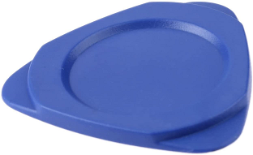
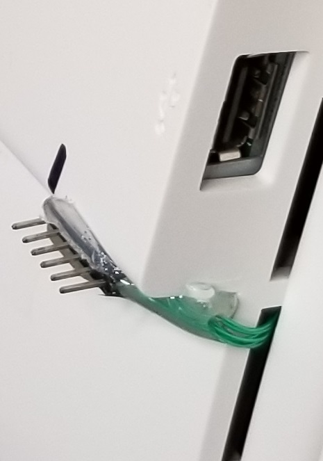

# Dissassembling the DZ22-2

I tired disassembling my DZ22-2 by following a [Youtube video](https://www.youtube.com/watch?v=FunpjWlPepY)
that I found but I had no luck.  

When I slipped and cut my hand I gave up and wrote [Pano_ldr](https://github.com/skiphansen/panog2_ldr)!  

All was good until I accidently flashed my test image at 0x90000 instead of 0x900000!
This mistake took out both pano_ldr and the golden image rendering my DZ22-2 a 
**brick**!  

Clearly a second attempt at opening the DZ22-2 was needed.  

I eventually figured out a way to open it and I was even able to put it back
together.  To my complete shock and delight it still worked.

Here's the procedure that worked for me.

Note that the LCD is held in place by the bezel alone so be careful the LCD
doesn't fall out as you are removing the bezel.

Begin by attacking the weakest link, the bezel above the switches.  Use
your fingers to pry the bezel away from the LCD and then insert a guitar 
pick style spundger between the LCD and the bezel.  

Push the spundger in as far as you can so the pressure will be between the 
LCD frame and the bezel rather between the glass and the bezel.

Move the spundger towards the corner slowly while wiggling the bezel
as much as you can.  It takes a lot of pressure but eventually the first tab
will snap loose.

Once the tab snaps loose you'll need to pull the spundger out enough to get
around the tab.  Try not to pull it all of the way out.

This is what we're dealing with:

Now continue past the first tab, around the corner, side, top, side and back
to the other end of the switches and the bezel should come off!

 

Now it's time to disconnect the LCD panel from the controller. This is easiest
if a second person is available to hold the LCD panel while the first person 
removes the black tape and disconnects the cable.

The LCD is attached to the controller with a cable that has a connector on
**BOTH** ends.  The LCD side is the better side to remove.

The LCD side of the cable has a locking mechanism which is disengaged by
squeezing both ends of the connector while gently pulling.  When the locking
mechanism is disengaged it doesn't take much force to pull the connector out.

The end that connects to the controller is difficult to remove because 
glue or stick tape has been added between the cable's connector and the 
board to prevent it from coming loose.  Not only does this makes it difficult 
to remove the connector it also makes it difficult to reattach properly 
without scraping off the glue.

After removing the 3 obvious screws the shield over the controller can be
opened.

 

And here is what we are probably looking for, the JTAG connector!

## JTAG connector pinout

The pinout is the same as G2 Panos:

1. Vref 2.5v
2. TDI
3. TMS
4. TDO
5. TCK
6. GND

I used wirewrap wire to extend the JTAG connector out the back via a cooling 
vent.  The new JTAG connector is hot glued to the back.

## Reassembly

Reassembly is straight forward and a LOT easier than the disassembly!  

Again this is easiest if a second person is available to hold the LCD panel 
while the first person reconnects the cable.

Just make sure that you snap in the button end of the bezel FIRST when 
reattaching the bezel.  

