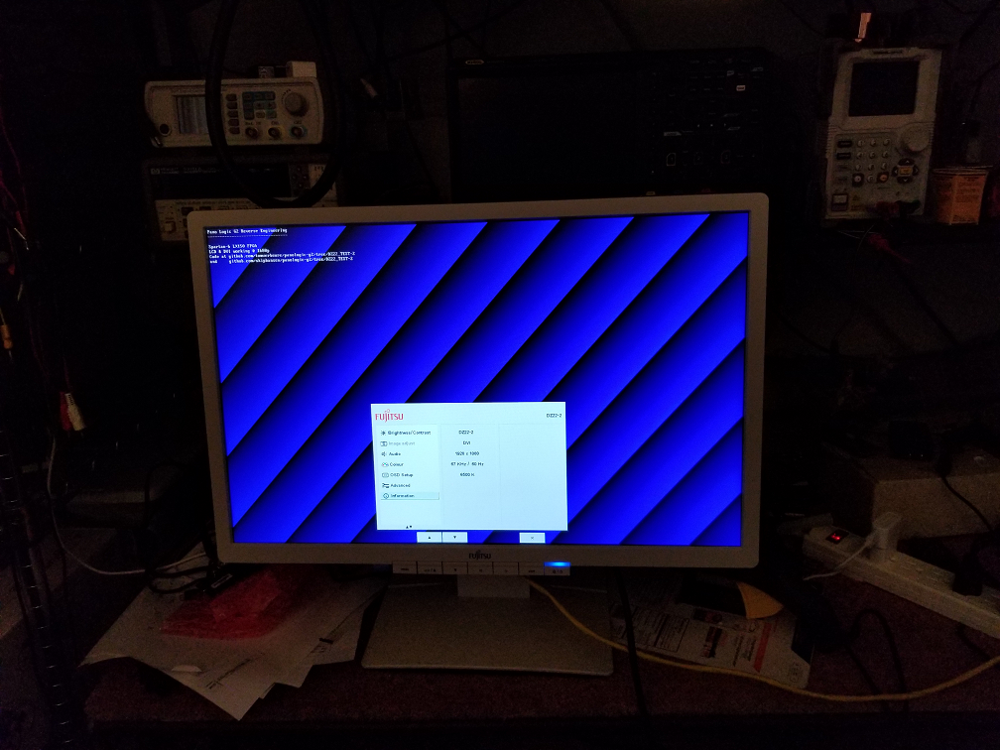

# Fujitsu Zero Client DZ22-2


This project contains information about hacking the Fujitsu Zero Client DZ22-2

This is an 22 in LCD monitor with a built in Pano device similar to the [Rev B G2](https://github.com/tomverbeure/panologic-g2/wiki/Identifying-different-Pano-generations-and-revisions#second-generation).  
Please see Tom Verbeure's reverse engineering [project](https://github.com/tomverbeure/panologic-g2)
for the G2 and the [Pano Hacker's Wiki](https://github.com/tomverbeure/panologic-g2/wiki)
for additional information.

My [Pano_ldr](https://github.com/skiphansen/panog2_ldr) has been successfully installed
and tested on the DZ22-2 **WITHOUT** opening the case.  In fact the DZ22-2 was my motivation 
for writting it.

If want to disassemble the DZ22-2 here are some [notes](./Disassembly.md).

## Features

- Based on the largest FPGA in the Spartan 6 family with 147,443k equivalent logic cells
- 1680 x 1050 pixels TFT LCD display with LED back lighting
- Swivel mount providing landscape or portrait orientation
- PoE (Power over Ethernet)
- Build in speakers with volume control
- 3.5 mm jack sockets for headphones **and** microphone.
- 4 USB sockets
- DVI-D port for second monitor
- digital screen controller with microprocessor for storing 12 different display modes

## Status
Tom's test code for the G2 with minor modifications is working on both the LCD and the external 
monitor @ 1080p.  Attempts to change the resolution to 640x480 and 1680x1050 have failed so far.  
It's probably an cockpit error on my part.



## Differences from G2

1. The red/green/blue LEDs on the G2 are not present, the LCD controller controls the LEDs behind the power switch.
2. The G2's DVI output drives the LCD controller.
3. The G2's mini HDMI second monitor is replaced with a DVI connector.
4. Instead of a single tiny speaker there are two speakers driven by a amplifier.
5. There are four lines from the FPGA to the scaler CPU that convey status, these signals must be driven to power up the LCD.
6. No dedicated "Pano button" is present. The power switch doubles as the "Pano button" (see below).

## LCD interface

It appears that the DZ22 uses the same bitfile and basic design as a "normal" 
G2.  One of the monitor ports in connected internally to a NT68667FG monitor
controller which includes a scaler.

According to the [User Manual](./assets/4503673.pdf) the scaler should be
capable of handling horizontal rates from 30 to 82 kHz and vertical rates from 
59 to 76 Hz.  This will be handy for porting projects designed for VGA 
interfaces.

Interestingly the NT68667FG includes a 8031 processor which handles the OSD
display for screen adjustments was well as volume and power control.

The firmware for the NT68667FG appears to be store externally in an 128K SPI 
flash [chip](./Pm25LV010.pdf). There really shouldn't be any need to hack the 
controller's firmware, but that might be a fun project if someone is interested.  

The firmware even appears to be updateable via one of the USB ports after 
putting the controller in an update mode probably via some odd button press 
sequence.  Some old Philips LCD monitors used similar controllers and their 
[service manual](./assets/Philips_meridian2_service_manual.pdf) documented the 
procedure.

I was unable to find any information about programming the 8031, but Ghidra
supports it the 8031 ...

## EDID Info

The [i2cedidtest](https://github.com/skiphansen/pano_progfpga/blob/master/TestCommands.md#i2cedidtest) test
command dumps the EDID data for the LCD.  Once dumped [edid-decode](https://git.linuxtv.org/edid-decode.git) can
be used to decode it.
```
skip@Dell-7040:~/pano/edid-decode$ ./edid-decode dz22-2.hex
edid-decode (hex):

00 ff ff ff ff ff ff 00 1a b3 83 07 01 00 00 00
1b 15 01 03 80 2f 1e 78 2a c6 65 a0 59 58 9d 27
0e 50 54 01 08 00 81 00 95 00 01 01 01 01 01 01
01 01 01 01 01 01 21 39 90 30 62 1a 27 40 68 b0
36 00 da 28 11 00 00 1c 00 00 00 fd 00 3b 3d 1f
51 10 00 0a 20 20 20 20 20 20 00 00 00 fc 00 44
5a 32 32 2d 32 0a 20 20 20 20 20 20 00 00 00 ff
00 59 56 34 4b 30 30 30 30 30 31 0a 20 20 00 f6

----------------

Block 0, Base EDID:
  EDID Structure Version & Revision: 1.3
  Vendor & Product Identification:
    Manufacturer: FUS
    Model: 1923
    Serial Number: 1
    Made in: week 27 of 2011
  Basic Display Parameters & Features:
    Digital display
    Maximum image size: 47 cm x 30 cm
    Gamma: 2.20
    DPMS levels: Off
    RGB color display
    First detailed timing is the preferred timing
  Color Characteristics:
    Red  : 0.6279, 0.3476
    Green: 0.3447, 0.6152
    Blue : 0.1533, 0.0566
    White: 0.3134, 0.3291
  Established Timings I & II:
    DMT 0x09:   800x600    60.316541 Hz   4:3     37.879 kHz     40.000000 MHz
    DMT 0x10:  1024x768    60.003840 Hz   4:3     48.363 kHz     65.000000 MHz
  Standard Timings:
    DMT 0x1c:  1280x800    59.810326 Hz  16:10    49.702 kHz     83.500000 MHz
    DMT 0x2f:  1440x900    59.887445 Hz  16:10    55.935 kHz    106.500000 MHz
  Detailed Timing Descriptors:
    DTD 1:  1680x1050   59.954250 Hz   8:5     65.290 kHz    146.250000 MHz (474 mm x 296 mm)
                 Hfront  104 Hsync 176 Hback  280 Hpol N
                 Vfront    3 Vsync   6 Vback   30 Vpol P
    Display Range Limits:
      Monitor ranges (GTF): 59-61 Hz V, 31-81 kHz H, max dotclock 160 MHz
    Display Product Name: 'DZ22-2'
    Display Product Serial Number: 'YV4K000001'
Checksum: 0xf6
skip@Dell-7040:~/pano/edid-decode$
```

## Status LED

The following is copied from the operating manual for easy reference.

The colour of the LED indicator changes as follows:
|LED indicator | Status|
| - | - |
|blue |The Zero Client is switched on (Normal mode).|
|green |The Zero Client is switched on (ECO mode).|
|orange |Zero Client is in energy-saving mode.|
|not lit |Zero Client is turned off.|
|quickly flashing orange |Zero Client is getting IP address from DHCP server.|
|slowly flashing orange |Zero Client has obtained IP address from the DHCP server and is establishing a connection with the Zero Client Controller.|
|red |Zero Client has an error.|
|flashing red |Zero Client has not found a network.|

A long press on the on/off switch turns the device on or off.
Press the on/off switch briefly to log out from the Virtual Desktop, i.e.
simulate a press of the Pano button for the FPGA.

## Power and status control lines

The Pano gateware communicates with the LCD controller using 4 signals.  The
state of these signals determine how the LCD controller drives the power
switch's LEDs, what messages it displays on the LCD, and if power is enabled to
the LCD.

UCF definitions:

```
# DZ22-2: outputs to the NT68668
NET "pwr_status0" LOC = F8 | IOSTANDARD = LVCMOS33;
NET "pwr_status1" LOC = F9 | IOSTANDARD = LVCMOS33;
NET "pwr_status2" LOC = H10 | IOSTANDARD = LVCMOS33;
NET "pwr_status3" LOC = H11 | IOSTANDARD = LVCMOS33;
```

| pwr_status<br>value | Power Switch | LCD |
| - | - | - |
| 0x0 | solid yellow | After timeout "no signal, going to sleep" |
| 0x1 | flashing red | "no network available, please check network connection"|
| 0x2 | fast flashing yellow | "connecting please wait"|
| 0x3 | slow flashing yellow | "connecting please wait"|
| 0x5 | solid green | Prior screen cleared, if no video "no signal, going to sleep" |
| 0x4,<br>0x06 -> 0x0e | solid yellow | No change on screen, does not timeout w/o video |
| 0xf | solid red | "reset necessary, please do a power cycle or contact your administer" |


## Serial port

Having a serial port is usefuly in more ways than can be described.  Unfortunately neither the regular Pano
nor the DZ22-2 has one.  Howver the DDC lines on the external monitor DVI connector can be used for this
purpose given suitable RTL.  Please see the [Panologic G2 serial port connections](https://github.com/tomverbeure/panologic-g2/wiki/Panologic-G2-serial-port-connections) for more information.

## Links

- Pano Hacker's [Wiki](https://github.com/tomverbeure/panologic-g2/wiki)
- [PCB pictures](https://github.com/zsteva/panologic-fujitsu) take by Zeljko Stevanovic
- [User Manual](./assets/4503673.pdf)
- [Citrix XenDesktop Manual](./assets/62122223.pdf)
- SGM7222 USB switch [spec sheet](./assets/1640934749.pdf)
- [NT68667FG spec sheet](./assets/NT68667FG_Novatek.pdf)

